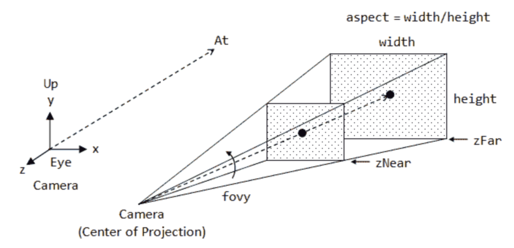

Categories:: #[[roam]]
Keywords:: #[[WebGPU]] #[[WebGL]]

- ## 一个最简WebGL示例
	- [hello-webgl](https://codepen.io/bencode/pen/QWPBvKg) #[[Example]]
	- ### 核心概念
		- #[[GPT]]
		- 在WebGL中的核心概念主要涵盖了用于在网页上进行3D渲染的一系列技术和方法。这些概念包括：
		- **WebGL上下文**：这是使用WebGL的起点，需要从HTML的元素获取WebGL上下文。它提供了绘图的功能和渲染的控制。
		- **着色器（Shaders）**：
			- **顶点着色器（Vertex Shaders）**：处理每个顶点的逻辑，例如变换顶点的位置。
			- **片段着色器（Fragment Shaders）**：处理形成最终像素颜色的逻辑，运行在渲染图形的每个像素上。
		- **程序（Programs）**：一个WebGL程序是由顶点着色器和片段着色器链接组成的，用于执行渲染的具体指令。
		- **缓冲区（Buffers）**：用于存储顶点数据（如位置、颜色等），WebGL使用缓冲区来读取顶点信息。
		- **顶点数组（Vertex Arrays）**：定义顶点属性的方法，如顶点的坐标位置，这些数据会被顶点着色器使用。
		- **绘图命令（Drawing Commands）**：如 drawArrays 或 drawElements，这些命令指示WebGL如何使用当前的顶点数据和着色器程序来生成图形。
		- **统一变量（Uniforms）**：这些是在着色器程序执行期间保持不变的变量，可用于传递颜色、转换矩阵等数据给着色器。
		- **属性（Attributes）**：这些是顶点着色器中使用的变量，通常每个顶点都有不同的值，如顶点的位置或颜色信息。
		- **纹理（Textures）**：用于在3D对象上添加详细的图像，可以增强视觉效果。
		- **GLSL（OpenGL Shading Language）**：这是用于编写着色器的编程语言，具有强大的数学运算功能，专门设计来运行在图形处理单元（GPU）上。
		  
		  通过这些核心概念的协同工作，WebGL能够在网页浏览器中创建复杂的3D图形和动画效果，从而为用户提供丰富和互动的视觉体验。
	- ### 特点
		- C like API
		- Shading Language (GLSL)
	- ### 参考资源
		- [MDN WebGL](https://developer.mozilla.org/en-US/docs/Web/API/WebGL_API)
		- [WebGL Fundanmentals](https://webglfundamentals.org/)
- ## WebGL vs WebGPU
	- WebGL历史
		- OpenGL 桌面版 (1993)
		- WebGL 1.0 (2011) 基于 OpenGL ES 2.0
		- WebGL 2.0 (2017) 基于 OpenGL ES 3.0 (2012)
		- #[[Reference]] [OpenGL ES3.0 Reference Page](https://registry.khronos.org/OpenGL-Refpages/es3/)
	- WebGPU历史
		- Vulkan (2016) 由 Khronos 小组创建，这个跨平台 API 是 OpenGL 的“继承者”。
		- D3D12 (2015) 由 Microsoft 创建，专用于 Windows 和 Xbox
		- Metal (2014) 由 Apple 创建，是 Apple 设备的专有 API。它的设计考虑到了 Apple 硬件上的最佳性能。
		- #[[Reference]] [从WebGL迁移到WebGPU](https://hackernoon.com/zh/%E4%BB%8E-webgl-%E8%BF%81%E7%A7%BB%E5%88%B0-webgpu)
	- WebGPU 目标
		- 通用计算能够高效地在 GPU 上执行。
		- 提供一种人类可编写的语言，用于指定在 GPU 上运行的计算。
		- 能够在浏览器的多进程架构中实现，并维护 Web 的安全性。
		- #[[Reference]] [webgpu goals](https://gpuweb.github.io/gpuweb/explainer/#goals)
	- Why Not WebGL3
		- WebGL 1.0 和 WebGL 2.0 分别是 OpenGL ES 2.0 和 OpenGL ES 3.0 API 的 Javascript 投影。WebGL 的设计溯源至 1992 年发布的 OpenGL 1.0 API（该 API 进一步溯源至 1980 年代的 IRIS GL）。这一血统具有许多优势，包括大量可用的知识体系和从 OpenGL ES 到 WebGL 的应用程序移植相对容易。
		- 然而，这也意味着 WebGL 并不符合现代 GPU 的设计，导致 CPU 性能和 GPU 性能问题。这也使得在现代本地 GPU API 之上实现 WebGL 变得越来越困难。WebGL 2.0 Compute 是一次尝试在 WebGL 中添加通用计算功能，但与本地 API 的阻抗不匹配使得这项工作难度极大。WebGL 2.0 Compute 的贡献者决定将他们的努力集中在 WebGPU 上。
		- #[[Reference]] [why-not-webgl](https://gpuweb.github.io/gpuweb/explainer/#why-not-webgl3)
	- 另一份参考文档： [webgl-vs-webgpu](https://aircada.com/webgl-vs-webgpu/) #[[Reference]]
- ## 一个最简WebGPU示例
	- [webgpu-starter](https://codepen.io/bencode/pen/JjVBNOq?editors=1010) #[[Example]]
	- ### 核心概念
		- #[[GPT]]
		- **设备和适配器（Device and Adapter）**：
			- **适配器**：表示特定的GPU硬件，是请求物理设备的接口。
			- **设备**：是与 GPU 的逻辑连接，用于管理资源、队列和执行命令。
		- **命令编码器（Command Encoder）**：
			- 用于记录所有渲染和计算命令。命令编码器创建命令缓冲区，这些缓冲区存储了执行的命令序列。
		- **管线（Pipeline）**：
			- 定义了图形渲染或计算任务的完整状态，包括着色器和它们如何与顶点、颜色和纹理等资源交互。
			- **图形管线**：用于绘制操作，配置顶点和片段着色器以及其他渲染状态。
			- **计算管线**：专用于执行计算任务的着色器。
		- **着色器（Shaders）**：
			- 用于在 GPU 上执行图形和计算任务的程序。WebGPU 使用 WGSL（WebGPU Shader Language）来编写着色器。
		- **资源（Resources）**：
			- **缓冲区（Buffers）**：用于存储顶点数据、索引、统一缓冲区对象（UBO）或其他任何通用数据。
			- **纹理（Textures）**：图像资源，用于图形渲染中的像素数据。
		- **绑定组和绑定布局（Bind Group and Bind Group Layout）**：
			- **绑定组**：定义了一组资源（如缓冲区、纹理和采样器）和如何访问它们的信息的集合。
			- **绑定布局**：定义了绑定组的结构，指定如何组织和访问绑定到管线的资源。
		- **渲染通道和计算通道（Render Pass and Compute Pass）**：
			- **渲染通道**：定义了一系列绘图命令的执行环境，包括如何处理屏幕输出和使用哪些附件。
			- **计算通道**：专门用于执行计算着色器任务的环境。
		- **队列（Queue）**：
			- 负责提交和执行命令缓冲区的队列。这些队列处理命令的执行，如渲染和计算操作。
		- 这些核心概念共同定义了 WebGPU 的工作方式，提供了一套全面的工具，以支持复杂的图形渲染和计算任务。通过这些工具，开发者可以利用 GPU 的强大能力，创建高性能的 Web 应用和游戏。
- ## 如何学习
	- ### 教程和示例
		- 入门学习教程：[您的第一个WebGPU应用](https://codelabs.developers.google.com/your-first-webgpu-app?hl=zh-cn#4) ，我只跟到[第5步](https://stackblitz.com/edit/stackblitz-starters-3hhhwf?file=s02.js)；直接跳到最后一步: [webgpu-conway](https://codepen.io/bencode/pen/qBwymVz)。
		- 跟着示例学习： [WebGPU-Step-By-Step](https://github.com/jack1232/WebGPU-Step-By-Step)
		- 官网示例
			- [WebGPU samples](https://webgpu.github.io/webgpu-samples/?sample=gameOfLife#main.ts)
			- 之前做的DOM版生命游戏：[game-of-life-dom](https://codepen.io/bencode/pen/ZEJMyve)，后续做一版3D WebGPU版。
	- ### WGSL
		- 如果需要原生开发WebGPU, 或者实现基础库，则需要掌握WGSL。
		- 简介 #[[GPT]]
			- WebGPU Shading Language（WGSL）是专为 WebGPU 设计的着色器语言。WGSL 目标是为 WebGPU 提供一种安全、可移植且易于使用的语言，使开发者能够编写高效的图形和计算着色器。下面是对 WGSL 的一些关键特点和概念的总结：
			- 设计目标
			- **安全性**：WGSL 设计为一种内存安全的语言，以避免运行时错误和未定义行为，这对于网页环境中的稳定性和安全性至关重要。
			- **可移植性**：WGSL 的设计考虑到了跨不同平台和设备的一致性和可移植性，旨在在各种硬件上提供一致的性能和行为。
			- **易于使用**：WGSL 旨在易于学习和使用，同时与现有的 Web 技术栈无缝集成，降低学习曲线，便于开发者快速上手。
			- 语法和特点
			- **C风格的语法**：WGSL 的语法类似于 C 和其他现代着色器语言（如 GLSL），使得有其他着色器语言背景的开发者可以更容易地适应。
			- **模块化**：WGSL 支持模块化编程，允许开发者将着色器代码组织成可重用的模块，提高代码的可维护性和复用性。
			- **类型系统**：WGSL 提供了严格的类型系统，包括标量类型、向量、矩阵以及用户定义的结构体等。
			- **内置函数**：WGSL 包含广泛的内置数学函数，如三角函数、指数函数等，支持复杂的数学运算和图形变换。
			- **编译时检查**：WGSL 设计为在编译时进行大量检查，以确保着色器代码的正确性，减少运行时错误。
			- 与 WebGPU 的集成
			- **绑定和资源管理**：WGSL 与 WebGPU 的资源绑定和管理紧密集成，通过绑定组（bind group）机制来访问 GPU 资源如纹理、缓冲区等。
			- **管线配置**：WGSL 着色器是管线配置的核心部分，用于定义渲染管线（render pipeline）和计算管线（compute pipeline）的行为。
			- **交叉兼容**：WGSL 设计为与现有的 Web 标准兼容，支持在各种 WebGPU 实现上运行，包括桌面和移动平台。
			- 总的来说，WGSL 是一个专门为 Web 和 GPU 编程设计的现代着色器语言，它通过提供严格的语法规则和强大的功能，旨在帮助开发者安全、高效地开发图形和计算密集型 Web 应用
		- 参考资源：[https://gpuweb.github.io/gpuweb/wgsl/](https://gpuweb.github.io/gpuweb/wgsl/)
	- ## WebGPU的应用
		- 当前实现和兼容性：[implementaion status](https://github.com/gpuweb/gpuweb/wiki/Implementation-Status)
		- ### GPU计算
			- 计算矩阵乘积：[compute-mul-matrix](https://codepen.io/bencode/pen/yLrxoKO) #[[Example]]
			  id:: 6629288b-e4b7-4486-9b6e-04402fea2a91
			- TensorFlow.js: [tfjs-backend-webpug](https://github.com/tensorflow/tfjs/tree/master/tfjs-backend-webgpu) #[[Tensorflow]]
			- 示例，计算矩阵乘积：[tfjs-webgpu](https://codepen.io/bencode/pen/gOyZNxO) #[[Example]]
		- ### 3D类应用（VR、AR）
			- Three.js
				- 官方说正在支持
			- Babylon.js
				- [playground](https://playground.babylonjs.com/)
	- ## Orillusion
		- 一个适合入门3D应用开发的基于WebGPU的引擎（框架）。
		- ### 开始
			- [Hello Orillusion](https://codepen.io/bencode/pen/wvZxdLp?editors=0010) #[[Example]]
			- 光照 [orllusion-light](https://codepen.io/bencode/pen/GRLBvWz?editors=0010)
			- 坐标和变换：[https://www.orillusion.com/guide/core/transform.html](https://www.orillusion.com/guide/core/transform.html)
			- 光照2 [orllusion-light-transform](https://codepen.io/bencode/pen/poBGzJX?editors=1010)
		- ### 相机
			- 透视相机
				- [camara-perspective](https://codepen.io/bencode/pen/GRLBvXb?editors=0010) #[[Example]]
				- {:height 161, :width 294}
			- 正交相机
				- [camara-orth](https://codepen.io/bencode/pen/eYojExG?editors=0010) #[[Example]]
				- {:height 152, :width 296}
		- ### 几何体
			- 内置几何体：[orillusion-mesh-geometry](https://codepen.io/bencode/pen/GRLBMvZ) #[[Example]]
			- 内置几何体，官网示例：[Internal Geometry](https://codepen.io/bencode/pen/oNOPdvW?editors=0010)
		- ### 变换
			- [object-transform](https://codepen.io/bencode/pen/JjVayrr?editors=1010) #[[Example]]
		- ### 材质
			- [orillusion-textture](https://codepen.io/bencode/pen/vYMzWQJ) #[[Example]]
		- ### GLTF —— JPEG of 3D
			- [orillusion-glb](https://codepen.io/bencode/pen/gOydoEJ) #[[Example]]
			- 介绍 #[[GPT]]
				- GLTF (GL Transmission Format) 是一个开放标准的文件格式，用于传输和加载三维模型和场景的数据。这种格式被设计为“JPEG of 3D”——意图是为了成为一个快速、高效、能够在网络上交换3D内容的标准。GLTF有利于3D内容的快速加载和实时渲染，这使得它在网络应用和虚拟现实环境中特别受欢迎。
				- ### 主要特点
				- **全面性**: GLTF不仅支持3D模型的网格和纹理，还包括场景的结构、材质、动画、骨骼、摄像机和灯光信息。
				- **高效性**: 它使用JSON描述3D场景结构和格式，而实际的3D数据（如顶点和纹理）则存储在二进制文件中。这种分离使得数据可以被更快地加载和解析。
				- **可扩展性**: GLTF支持自定义扩展，允许开发者在不改变核心规范的基础上添加特定的功能。
				- **互操作性**: 因为GLTF是一个标准化的格式，所以它能被各种工具和平台广泛支持，包括三维建模软件、游戏引擎和WebGL框架。
				- ### 组件
				- **JSON (.gltf)**: 包含了模型的结构、动画、骨骼、摄像头、材质等信息。
				- **二进制数据 (.bin)**: 存储了模型的几何数据，如顶点坐标和纹理坐标。
				- **图像文件**: 通常是PNG或JPEG格式，用于纹理。
				- ### 使用场景
				- **网络应用**: GLTF优化了网络传输，使得3D模型能够快速加载，适用于WebGL和WebXR等Web应用。
				- **虚拟现实和增强现实**: 由于其对实时渲染的支持，GLTF在VR和AR平台中得到了广泛的应用。
				- **游戏开发**: 一些现代的游戏引擎支持导入GLTF格式，以便开发者利用其高效和全面的特性。
				- ### 支持的工具和平台
				- **建模软件**: Blender, Autodesk Maya, 3ds Max等
				- **游戏引擎**: Unity, Unreal Engine, Godot等
				- **Web技术**: Three.js, Babylon.js等
				  
				  GLTF是一个强大的工具，旨在简化和加速3D内容的交付和渲染，对于希望建立跨平台3D应用的开发者来说，了解和使用GLTF将是一个重要的优势。
			- 资源
				- [threejs examples](https://threejs.org/examples/#webgl_animation_skinning_blending) 有一些资源学习时可以使用。
				- [https://sketchfab.com/feed](https://sketchfab.com/feed) ，大部分收费，AI加持下是否会变便宜？
		- ### 还有什么
			- 光照和阴影
			- 动画
			- 物理引擎
			- 多媒体
	- ## 参考
		- [webgpu-from-webgl](https://webgpufundamentals.org/webgpu/lessons/webgpu-from-webgl.html)
		- [从WebGL迁移到WebGPU](https://hackernoon.com/zh/%E4%BB%8E-webgl-%E8%BF%81%E7%A7%BB%E5%88%B0-webgpu)
		- [webgpu goals](https://gpuweb.github.io/gpuweb/explainer/#goals)
		- [why-not-webgl](https://gpuweb.github.io/gpuweb/explainer/#why-not-webgl3)
		- [implementaion status](https://github.com/gpuweb/gpuweb/wiki/Implementation-Status)
		- [您的第一个WebGPU应用](https://codelabs.developers.google.com/your-first-webgpu-app?hl=zh-cn#0) 注意最后一页的扩展参考资料
		- [WSGL Reference](https://gpuweb.github.io/gpuweb/wgsl/)
		- [WebGPU computations performance in comparison to WebGL](https://pixelscommander.com/javascript/webgpu-computations-performance-in-comparison-to-webgl)
		- [WebGPU-Step-By-Step](https://github.com/jack1232/WebGPU-Step-By-Step)
		- [WebGL vs WebGPU](https://aircada.com/webgl-vs-webgpu/)
		- [WebGPU - All of the core, none of the canvas](https://surma.dev/things/webgpu/)