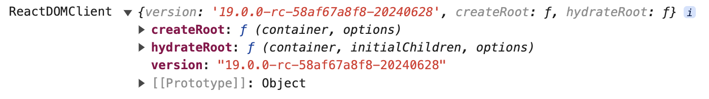

name:: dive-into-react19
category:: #[[React]]

- ## API的变化
- ```typescript
  import React from 'react'
  import ReactDOM from 'react-dom'
  import ReactDOMClient from "react-dom/client"
  
  console.log(React)
  console.log(ReactDOM)
  console.log(ReactDOMClient)
  ```
- React
	- {:height 474, :width 420}
	- 并发渲染相关API
		- Suspense
		- cache
		- startTransition
		- use
		- useActionState
		- useDeferredValue
		- useOptimistic
		- useTransition
	- 其他
		- act
		- useInsertionEffect
		- useSyncExternalStore
- ReactDOM
	- 
	- React19相关API
		- 表单相关
			- requestFormReset
			- useFormState // 已废弃，由 useActionState代替
			- useFormStatus
		- 性能相关
			- prefetchDNS
			- preconnect
			- preload
			- preloadModule
			- preinit
			- preinitModule
- ReactDOMClient
	- 
- 由于正式版还没发布，目前用的是rc版，ReactDOM包的API没有变化, React包中加了一些API。
- 相关API
	- RSC (React Server Components)
		- cache
	- Test
		- act
- 分组
	- 并发渲染有关
	- 表单相关
		- useFormStatus
			- 用于在form内部，深层组件中取得表单状态
			- 是基于context创建的吗？
		- useActionState
		- action/formAction
			- ```
			  <form>
			  <button>
			  <input>
			  ```
		-
- ## Actions
	- Actions: functions that use async transitions
	- Features
		- Pending state
		- Optimistic updates
			- UI pattern
				- 如果没有optimistic，则需要另一个state，那更新state时，就会比较麻烦，不大可能
				- 因为在effect中会多一次render
		- Error handling
		- Forms
	- Action是可组合的
- ## Transition
	- transition vs useState
		- 不需要处理ending状态
		- 内部就是state?
	- optimistic update vs state
- TODO
	- 用原始API 实现一个 error / pending / optimistic的示例
	- 用新API实现。
	- 用form api进一步实现
	- 自定义 useOptimistic 使用 useState / useEffect实现。
- ## Use
	- 资源处理。
		- 目前支持Promise和Context
	- Promise是一种资源， 可代码数据， 封装了状态的数据。
	- 加载数据的好的模式？
	- 服务器组件中优先使用 async/await
	- use可以在循环或条件语句中使用
	- Why其他React组件的hooks不能在循环或条件中使用？
- 19的很多改进，主要是针对于Server Components, 期望是在 Server Component中创建Promise，传递给 ClientComponent。
- ## 边界
	- Suspense
	- ErrorBoundary
- ## Use
	- use(Context)
- ## 改进
- ref
	- deprecated forwardRef
- Context as a provider
- Document Metadata
	- title, meta, link will move to head
- ## Other
- 根据文档，以下API有的已废弃，有些将被废弃，所以使用时需要注意。
	- Children
		- 用几以下几种方法可以代替
		- children
		- props
		- render
	- cloneElement
	- Component
	- createElement
	- createFactory
	- createRef
	- isValidElement
	- PureComponent
- React 19简介
	- Actions
		- pending, error, optimistic, async request
- ## 参考
- [React 19 RC](https://react.dev/blog/2024/04/25/react-19)