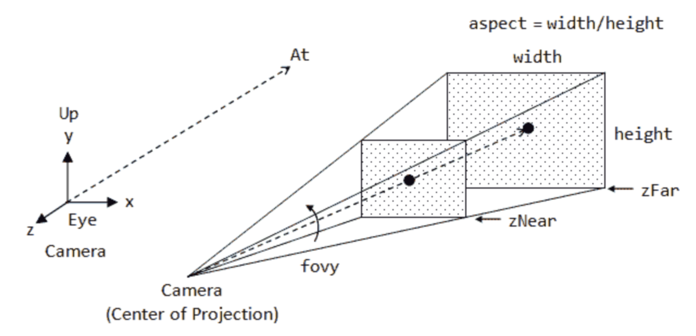
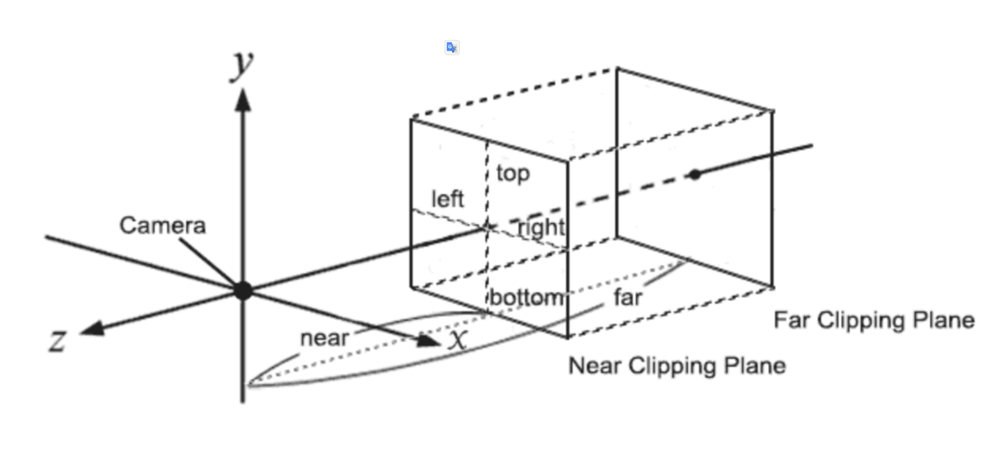

alias:: 初探WebGPU
category:: #[[roam]]

- ## 一个最简WebGL示例
	- [hello-webgl](https://codepen.io/bencode/pen/QWPBvKg)
	  id:: 6629243b-9def-4c3e-b6f6-64e2d1791154
	  render:: codepen
	- See: ((6629243b-9def-4c3e-b6f6-64e2d1791154))
	- ### 特点
		- C like API
		- Shading Language (GLSL)
	- ### 参考资源
		- [MDN WebGL](https://developer.mozilla.org/en-US/docs/Web/API/WebGL_API)
		- [WebGL Fundanmentals](https://webglfundamentals.org/)
		- [[Menu]]
- ## WebGL vs WebGPU
	- WebGL历史
		- OpenGL 桌面版 (1993)
		- WebGL 1.0 (2011) 基于 OpenGL ES 2.0
		- WebGL 2.0 (2017) 基于 OpenGL ES 3.0 (2012)
		- #[[Reference]] [OpenGL ES3.0 Reference Page](https://registry.khronos.org/OpenGL-Refpages/es3/)
	- WebGPU历史
		- Vulkan (2016) 由 Khronos 小组创建，这个跨平台 API 是 OpenGL 的“继承者”。
		- D3D12 (2015) 由 Microsoft 创建，专用于 Windows 和 Xbox
		- Metal (2014) 由 Apple 创建，是 Apple 设备的专有 API。它的设计考虑到了 Apple 硬件上的最佳性能。
		- #[[Reference]] [从WebGL迁移到WebGPU](https://hackernoon.com/zh/%E4%BB%8E-webgl-%E8%BF%81%E7%A7%BB%E5%88%B0-webgpu)
	- WebGPU 目标
		- 通用计算能够高效地在 GPU 上执行。
		- 提供一种人类可编写的语言，用于指定在 GPU 上运行的计算。
		- 能够在浏览器的多进程架构中实现，并维护 Web 的安全性。
		- #[[Reference]] [webgpu goals](https://gpuweb.github.io/gpuweb/explainer/#goals)
	- Why Not WebGL3
		- WebGL 1.0 和 WebGL 2.0 分别是 OpenGL ES 2.0 和 OpenGL ES 3.0 API 的 Javascript 投影。WebGL 的设计溯源至 1992 年发布的 OpenGL 1.0 API（该 API 进一步溯源至 1980 年代的 IRIS GL）。这一血统具有许多优势，包括大量可用的知识体系和从 OpenGL ES 到 WebGL 的应用程序移植相对容易。
		- 然而，这也意味着 WebGL 并不符合现代 GPU 的设计，导致 CPU 性能和 GPU 性能问题。这也使得在现代本地 GPU API 之上实现 WebGL 变得越来越困难。WebGL 2.0 Compute 是一次尝试在 WebGL 中添加通用计算功能，但与本地 API 的阻抗不匹配使得这项工作难度极大。WebGL 2.0 Compute 的贡献者决定将他们的努力集中在 WebGPU 上。
		- #[[Reference]] [why-not-webgl](https://gpuweb.github.io/gpuweb/explainer/#why-not-webgl3)
	- 另一份参考文档： [webgl-vs-webgpu](https://aircada.com/webgl-vs-webgpu/) #[[Reference]]
- ## 一个最简WebGPU示例
	- [webgpu-starter](https://codepen.io/bencode/pen/JjVBNOq?editors=1010)
	  render:: codepen
- ## 如何学习
	- ### 教程和示例
		- 入门学习教程：[您的第一个WebGPU应用](https://codelabs.developers.google.com/your-first-webgpu-app?hl=zh-cn#4) ，我只跟到[第5步](https://stackblitz.com/edit/stackblitz-starters-3hhhwf?file=s02.js)。
		- [webgpu-conway](https://codepen.io/bencode/pen/qBwymVz)
		  render:: codepen
		- 跟着示例学习： [WebGPU-Step-By-Step](https://github.com/jack1232/WebGPU-Step-By-Step)
		- 官网示例
			- [WebGPU samples](https://webgpu.github.io/webgpu-samples/?sample=gameOfLife#main.ts)
			- 之前做的DOM版生命游戏：[game-of-life-dom](https://codepen.io/bencode/pen/ZEJMyve)，后续做一版3D WebGPU版。
			- [game-of-life-dom](https://codepen.io/bencode/pen/ZEJMyve)
			  render:: codepen
	- ### WGSL
		- 参考资源：[https://gpuweb.github.io/gpuweb/wgsl/](https://gpuweb.github.io/gpuweb/wgsl/)
	- ## WebGPU的应用
		- 当前实现和兼容性：[implementaion status](https://github.com/gpuweb/gpuweb/wiki/Implementation-Status)
		- ### GPU计算
			- 计算矩阵乘积：[compute-mul-matrix](https://codepen.io/bencode/pen/yLrxoKO)
			  id:: 6629288b-e4b7-4486-9b6e-04402fea2a91
				- [compute-mul-matrix](https://codepen.io/bencode/pen/yLrxoKO)
				  render:: codepen
			- TensorFlow.js: [tfjs-backend-webpug](https://github.com/tensorflow/tfjs/tree/master/tfjs-backend-webgpu) #[[Tensorflow]]
			- 示例，计算矩阵乘积：[tfjs-webgpu](https://codepen.io/bencode/pen/gOyZNxO)
				- [tfjs-webgpu](https://codepen.io/bencode/pen/gOyZNxO)
				  render:: codepen
		- ### 3D类应用（VR、AR）
		  id:: 66d15c92-8055-4dee-8507-52a34dfc5ce8
			- Three.js
				- 官方说正在支持
			- Babylon.js
				- [playground](https://playground.babylonjs.com/)
	- ## Orillusion
		- 一个适合入门3D应用开发的基于WebGPU的引擎（框架）。
		- ### 开始
			- [Hello Orillusion](https://codepen.io/bencode/pen/wvZxdLp?editors=0010)
			  render:: codepen
			- 光照 [orllusion-light](https://codepen.io/bencode/pen/GRLBvWz?editors=0010)
			  render:: codepen
			- 坐标和变换：[orillusion-transform](https://www.orillusion.com/guide/core/transform.html)
			- 光照2 [orllusion-light-transform](https://codepen.io/bencode/pen/poBGzJX?editors=1010)
			  render:: codepen
		- ### 相机
			- 透视相机
				- [camara-perspective](https://codepen.io/bencode/pen/GRLBvXb?editors=0010)
				  render:: codepen
				- {:height 161, :width 294}
			- 正交相机
				- [camara-orth](https://codepen.io/bencode/pen/eYojExG?editors=0010)
				  render:: codepen
				- {:height 152, :width 296}
		- ### 几何体
			- 内置几何体：[orillusion-mesh-geometry](https://codepen.io/bencode/pen/GRLBMvZ)
			  render:: codepen
			- 内置几何体，官网示例：[Internal Geometry](https://codepen.io/bencode/pen/oNOPdvW?editors=0010)
		- ### 变换
			- [object-transform](https://codepen.io/bencode/pen/JjVayrr?editors=1010)
			  render:: codepen
		- ### 材质
			- [orillusion-textture](https://codepen.io/bencode/pen/vYMzWQJ)
			  render:: codepen
		- ### GLTF —— JPEG of 3D
			- [orillusion-glb](https://codepen.io/bencode/pen/gOydoEJ)
			  render:: codepen
			- 资源
				- [threejs examples](https://threejs.org/examples/#webgl_animation_skinning_blending) 有一些资源学习时可以使用。
				- [https://sketchfab.com/feed](https://sketchfab.com/feed) ，大部分收费，AI加持下是否会变便宜？
		- ### 还有什么
			- 光照和阴影
			- 动画
			- 物理引擎
			- 多媒体
	- ## 参考
	  id:: 6629295d-f183-4b92-bed4-3c863c19f5b6
		- [webgpu-from-webgl](https://webgpufundamentals.org/webgpu/lessons/webgpu-from-webgl.html)
		- [从WebGL迁移到WebGPU](https://hackernoon.com/zh/%E4%BB%8E-webgl-%E8%BF%81%E7%A7%BB%E5%88%B0-webgpu)
		- [webgpu goals](https://gpuweb.github.io/gpuweb/explainer/#goals)
		- [why-not-webgl](https://gpuweb.github.io/gpuweb/explainer/#why-not-webgl3)
		- [implementaion status](https://github.com/gpuweb/gpuweb/wiki/Implementation-Status)
		- [您的第一个WebGPU应用](https://codelabs.developers.google.com/your-first-webgpu-app?hl=zh-cn#0) 注意最后一页的扩展参考资料
		- [WSGL Reference](https://gpuweb.github.io/gpuweb/wgsl/)
		- [WebGPU computations performance in comparison to WebGL](https://pixelscommander.com/javascript/webgpu-computations-performance-in-comparison-to-webgl)
		- [WebGPU-Step-By-Step](https://github.com/jack1232/WebGPU-Step-By-Step)
		- [WebGL vs WebGPU](https://aircada.com/webgl-vs-webgpu/)
		- [WebGPU - All of the core, none of the canvas](https://surma.dev/things/webgpu/)